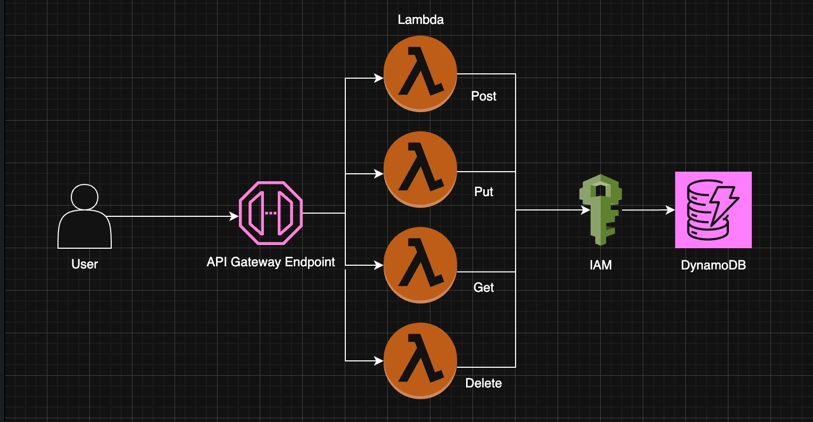
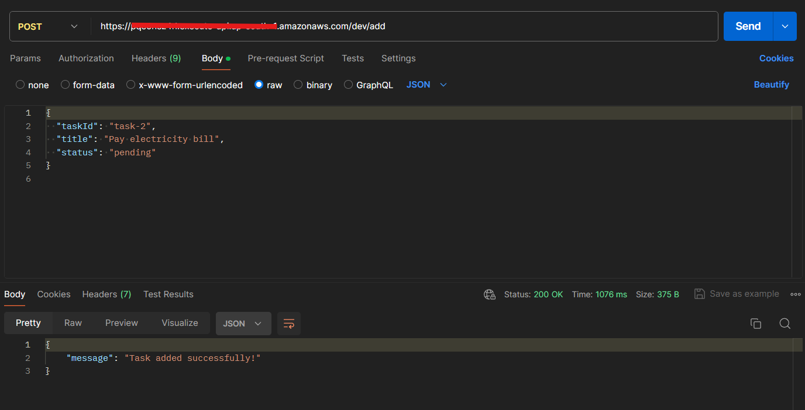
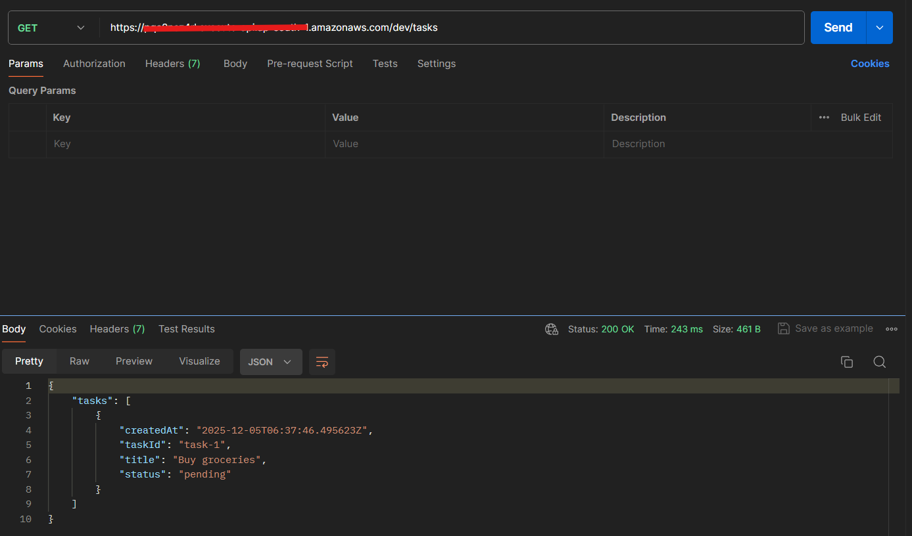
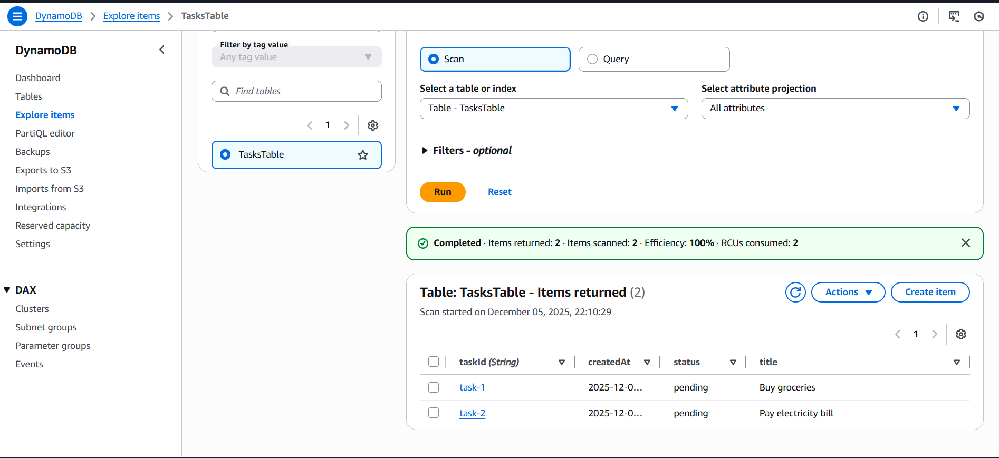

# Serverless To-Do Application (AWS Lambda + API Gateway + DynamoDB)

A fully serverless backend application that provides **CRUD APIs** for managing to-do tasks.  
This project uses **AWS Lambda**, **API Gateway**, and **DynamoDB** to build a scalable, cost-efficient, and maintenance-free backend service.

## What This Project Includes
- ➕ Add Task (POST)
- 📄 Get All Tasks (GET)
- ✏️ Update Task (PUT)
- ❌ Delete Task (DELETE)


## Features

Fully serverless backend built using AWS Lambda, API Gateway, and DynamoDB.

- Four separate Lambda functions implementing full CRUD operations:  
  - **Add Task (POST)**  
  - **Get Tasks (GET)**  
  - **Update Task (PUT)**  
  - **Delete Task (DELETE)**

- DynamoDB used as a fast, scalable, and cost-efficient NoSQL database  
- API Gateway endpoints created for each operation  
- Clean and well-structured project layout for easy understanding and contribution  
- No server management required — automatically scales with usage  
- Secure and isolated execution using AWS IAM roles and Lambda permissions  
- Lightweight, cost-efficient, and suitable for showcasing cloud and backend skills


## Project Structure

The project follows a simple and clean folder structure to keep Lambda functions organized.

```
Serverless-ToDo-App/
│
├── lambdas/
│   ├── add_task.py
│   ├── get_tasks.py
│   ├── update_task.py
│   └── delete_task.py
│
├── .gitignore
└── README.md
```
Each Lambda function is separated for clarity and easier maintenance. The `.gitignore` file prevents unnecessary local files from being pushed to the repository.


## Tech Stack

**Cloud Provider:**  
- AWS (Amazon Web Services)

**Services Used:**  
- **AWS Lambda** – For running backend logic without servers  
- **Amazon API Gateway** – For creating REST API endpoints  
- **Amazon DynamoDB** – NoSQL database for storing tasks  
- **AWS IAM** – For permissions and secure access control  

**Language:**  
- Python 3.12

**Tools:**  
- Postman (for API testing)  
- Git & GitHub (for version control and hosting the project)


## Architecture

The Serverless To-Do App uses a fully managed, event-driven architecture on AWS.  
Each operation (Add, Get, Update, Delete) is handled by a separate Lambda function, and all requests flow through API Gateway.

### High-Level Architecture Flow

1. The client sends an HTTP request to an API Gateway endpoint.
2. API Gateway triggers the corresponding AWS Lambda function.
3. The Lambda function processes the request and interacts with DynamoDB.
4. DynamoDB stores or retrieves the task data.
5. The Lambda function returns a response back through API Gateway to the client.

### Architecture Components

- **Amazon API Gateway**  
  Exposes REST API endpoints for all CRUD operations.

- **AWS Lambda Functions**  
  Individual functions for `add_task`, `get_tasks`, `update_task`, and `delete_task`.

- **Amazon DynamoDB**  
  NoSQL database used for storing all To-Do tasks.

- **IAM Roles & Permissions**  
  Secure access between Lambda and DynamoDB.

### Architecture Diagram

Below is the architecture diagram representing the flow of the Serverless To-Do App.




## API Reference

### Add Task
- **POST** `/add`  
- **Body:**
```json
{
  "taskId": "task-1",
  "title": "Buy groceries",
  "status": "pending"
}
```
- **Response:** 
```json
{
    "message": "Task added successfully!"
}
```

### Get Tasks

- **GET** `/tasks`

- **Response:** 
```json
{
  "tasks": [
    {
      "taskId": "task-1",
      "title": "Buy groceries",
      "status": "pending",
      "createdAt": "2025-12-05T10:00:00Z"
    }
  ] 
}
 ```

### Update Task

- **PUT** `/update`

- **Body:**
```json
{
  "taskId": "task-2",
  "title": "Pay electricity bill (updated)",
  "status": "completed"
}
```
- **Response:** 
```json
{
    "message": "Task updated successfully!"
}
```
### Delete Task

- **DELETE** `/delete`

- **Body:**
```json

{
    "taskId": "task-1"
}
```
- **Response:**
```json
{
    "message": "Task deleted successfully!"
}
```

**Replace the base URL with your API Gateway Invoke URL.**
## Deployment

This project is fully serverless and hosted on AWS. To deploy or run it yourself, follow these steps:

### 1. Clone the Repository
```bash
git clone https://github.com/Nishika10/Serverless-ToDo-App.git
cd Serverless-ToDo-App
```
### 2. Deploy Lambda Functions

- Create four Lambda functions on AWS:

  - Add Task

  - Get Tasks

  - Update Task

  - Delete Task

- Copy the respective .py file from the lambdas/ folder into each function.

### 3. Configure API Gateway

- Create a REST API

- Add resources /add, /tasks, /update, /delete

- Integrate each resource with its corresponding Lambda function

- Deploy the API to a stage (e.g., dev) to get your Invoke URLs

### 4. Test APIs

- Use Postman or curl with the provided endpoints to ensure everything works correctly.

Once deployed, this setup automatically scales, requires no server management, and can be accessed from anywhere.
## Screenshots

### 1. Add Task (POST Request)
Example of adding a new task using the `/add` endpoint.


### 2. Get All Tasks (GET Request)
Example of retrieving all tasks using the `/tasks` endpoint.


### 3. DynamoDB Table View
Stored tasks visible in the DynamoDB table.



## License

This project is licensed under the MIT License - see the [LICENSE](LICENSE) file for details.

## Author
**Nishika Jaiswal**

Aspiring Cloud & DevOps Engineer


